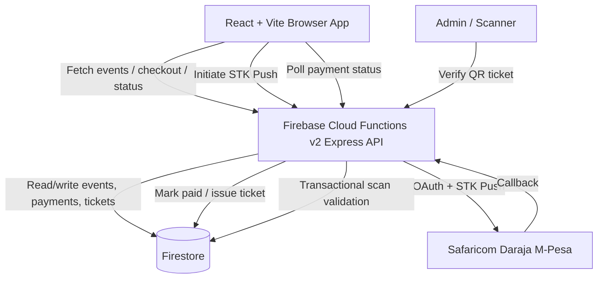

# Tickomag

Tickomag is an event ticketing platform built with React, Vite, Firebase Cloud Functions, Firestore, and Safaricom M-Pesa STK Push payments.

## Overview

Tickomag supports event discovery, ticket checkout, M-Pesa payment confirmation, QR ticket issuance, and gate verification for event operators.

The platform solves the operational problem of selling tickets, linking payments to attendees, issuing scannable tickets, and validating entry at the venue. It is built for public event attendees, event administrators, and gate scanning staff.

The system uses a React + Vite frontend, Firebase Auth for administrator access, Firestore for persistent operational data, and a Firebase Cloud Functions v2 Express API for payment, ticketing, event, and scanner workflows.

## Features

### Frontend

- Event discovery and event detail pages
- Checkout flow for published events and ticket types
- M-Pesa STK Push initiation
- Payment status tracking with bounded polling
- QR ticket rendering
- Ticket lookup by M-Pesa receipt or ticket code
- Admin login and protected admin routes
- Operations dashboard for payments, tickets, requests, and scans
- Manual ticket request review dashboard
- QR ticket scanner using `html5-qrcode`
- Responsive UI with reusable layout, ticket, event, and UI components

### Backend

- Express API deployed on Firebase Cloud Functions v2
- Firestore-backed events, payments, tickets, scans, and admin data
- M-Pesa STK Push integration through Safaricom Daraja
- Safaricom callback processing
- Payment status and ticket lookup endpoints
- Transactional ticket generation after successful payment
- Payment timeout scheduler for stale pending payments
- QR ticket verification with scan audit logging
- Distributed Firestore-backed rate limiter
- Admin authorization middleware
- Firestore transactions for ticket issuance and scan validation

## Architecture

The browser communicates with a Firebase Cloud Functions Express API for public event data, checkout, payment status, ticket lookup, and authenticated scanner operations. Firestore stores events, payment records, callbacks, issued tickets, scan attempts, admin profiles, and manual ticket request state.

Payment processing is asynchronous. The frontend initiates an STK Push, the backend records the pending payment, Safaricom sends a callback, and the backend updates payment state and issues a QR ticket.



## Tech Stack

### Frontend

| Technology | Purpose |
|---|---|
| React 19 | UI application |
| Vite 8 | Development server and production build |
| React Router | Client-side routing |
| Firebase Web SDK | Firebase Auth and Firestore client access |
| `react-qr-code` | QR ticket rendering |
| `html5-qrcode` | Admin scanner camera integration |
| CSS | Page and component styling |

### Backend

| Technology | Purpose |
|---|---|
| Node.js 22 | Cloud Functions runtime |
| Firebase Cloud Functions v2 | Serverless backend hosting |
| Express | HTTP routing |
| Firebase Admin SDK | Firestore and Auth administration |
| Firestore | Persistent datastore |
| Axios | Safaricom Daraja HTTP calls |
| Firebase Scheduler | Payment timeout job |

### Infrastructure

| Service | Purpose |
|---|---|
| Firebase Functions | Backend deployment |
| Firestore | Database |
| Firebase Auth | Admin authentication |
| Firestore Rules | Client-side data access control |
| Firestore TTL | Cleanup for rate-limit records |
| Vercel | Frontend hosting |
| Firebase Emulator | Local functions development |

### External APIs

| API | Purpose |
|---|---|
| Safaricom Daraja OAuth | M-Pesa access token generation |
| Safaricom Daraja STK Push | Customer payment prompts |

## Project Structure

| Path | Purpose |
|---|---|
| `src/` | Frontend application source. |
| `src/pages/` | Route-level screens for public pages, checkout, ticket lookup, and admin workflows. |
| `src/components/` | Reusable UI, layout, event, ticket, and intro components. |
| `src/services/` | Frontend API clients, Firebase setup, Firestore subscriptions, scanner calls, and payment requests. |
| `src/context/` | Admin authentication context. |
| `src/routes/` | React Router definitions and protected admin route wrapper. |
| `src/assets/` | Event images and static visual assets used by the frontend. |
| `src/utils/` | Shared frontend helpers for QR payloads, ticket codes, calendar files, hashing, formatting, and downloads. |
| `src/practice/` | Practice checkout component kept separate from production route code. |
| `functions/` | Firebase Cloud Functions backend. |
| `functions/controllers/` | Express request handlers for events, M-Pesa, status, and ticket verification. |
| `functions/routes/` | Express route registration. |
| `functions/services/` | Backend business logic for events, M-Pesa, tickets, timeouts, and Firebase Admin setup. |
| `functions/middleware/` | Request middleware for admin authorization and distributed rate limiting. |
| `functions/config/` | M-Pesa environment configuration. |
| `functions/data/` | Event seed data. |
| `functions/scripts/` | Firestore event seeding script. |
| `functions/utils/` | Backend helpers for ticket and scan token generation. |

## Payment Flow

1. The attendee selects an event ticket and submits the checkout form.
2. The frontend calls `POST /api/mpesa/stk-push`.
3. The backend validates phone, event ID, ticket ID, quantity, and attendee payload shape.
4. The backend reads the event and ticket quote from Firestore.
5. The backend obtains a Safaricom OAuth token, reusing a cached token on warm function instances.
6. The backend sends the STK Push request to Safaricom Daraja.
7. A pending payment document is created in `mpesaPayments` using `CheckoutRequestID`.
8. The frontend polls `GET /api/mpesa/payment-status/:checkoutRequestID` every four seconds for up to two minutes.
9. Safaricom sends the STK callback to `POST /api/mpesa/callback`.
10. The callback is recorded in `mpesaCallbacks`.
11. Failed callbacks update the payment to `failed`.
12. Successful callbacks update the payment to `paid`.
13. Ticket issuance runs in a Firestore transaction.
14. The ticket service creates a ticket with a ticket code, scan token, and QR payload in the format `TM1.{ticketId}.{scanToken}`.
15. The payment is updated with `ticketIssued`, `ticketId`, and `ticketCode`.
16. A scheduled function marks pending payments as `timed_out` if no callback is received before `timeoutAt`.

Late successful callbacks are still processed. If a timed-out payment later receives a successful callback, the backend updates it to `paid` and issues the ticket if one has not already been created.

## Security

- Firestore rules restrict direct client reads for sensitive collections such as payments, callbacks, tickets, scans, and admin operational data.
- Public customer payment status is exposed through the backend API instead of direct Firestore reads.
- Admin access uses Firebase Auth plus an `admins/{uid}` profile check for `role == "admin"` and active status.
- The scanner verification endpoint requires a Bearer Firebase ID token.
- STK Push initiation is protected by a distributed Firestore rate limiter.
- Ticket verification is protected by a distributed Firestore rate limiter.
- Rate-limit records hash client identity and expire through Firestore TTL.
- STK Push payloads are validated before quote lookup, payment initiation, or Firestore writes.
- Ticket issuance uses Firestore transactions and approved-payment guard documents to prevent duplicate tickets.
- QR scan tokens are compared with `crypto.timingSafeEqual`.
- Ticket scans update ticket state transactionally to prevent replay after a ticket is consumed.
- Payment timeout logic avoids overwriting completed payments by re-checking payment and callback state inside a transaction.

## Performance Optimizations

- M-Pesa OAuth access tokens are cached in warm Cloud Function instances.
- M-Pesa HTTP calls use an HTTPS keep-alive agent.
- M-Pesa API calls have a request timeout to avoid indefinitely hanging requests.
- Frontend event list requests are reused through a shared in-flight promise.
- Event detail fetches reuse cached event data when the catalog was already loaded.
- Customer payment status uses bounded API polling instead of direct public Firestore subscriptions.
- Payment polling runs every four seconds and stops after `paid`, `failed`, `timed_out`, or a two-minute maximum wait.
- Payment timeout scheduler queries only expired pending payments with `timeoutAt <= now`.
- Firestore rate-limit documents are configured for TTL cleanup.

## Installation

### Clone

```bash
git clone <repository-url>
cd tickomag-ticketing-platform
```

### Install Dependencies

Frontend:

```bash
npm install
```

Backend:

```bash
cd functions
npm install
cd ..
```

### Environment Variables

Create `.env` in the project root using `.env.example` as a reference.

Create `functions/.env` using `functions/.env.example` as a reference.

Do not commit real credentials or service account files.

### Run Locally

Frontend:

```bash
npm run dev
```

Functions emulator:

```bash
npm --prefix functions run serve
```

Seed events:

```bash
npm --prefix functions run seed:events
```

### Build

```bash
npm run build
```

### Deployment

Deploy Firebase functions:

```bash
firebase deploy --only functions
```

Deployed the frontend through Vercel or with your own choice. The repository includes `vercel.json` with SPA rewrites to `index.html`.

## Environment Variables

### Frontend

| Variable | Description |
|---|---|
| `VITE_FUNCTIONS_API_URL` | Base URL for the Cloud Functions API. |
| `VITE_MPESA_API_BASE_URL` | Base URL for M-Pesa API routes. Defaults to `${VITE_FUNCTIONS_API_URL}/mpesa`. |
| `VITE_FIREBASE_API_KEY` | Firebase web app API key. |
| `VITE_FIREBASE_AUTH_DOMAIN` | Firebase Auth domain. |
| `VITE_FIREBASE_PROJECT_ID` | Firebase project ID. |
| `VITE_FIREBASE_STORAGE_BUCKET` | Firebase storage bucket. |
| `VITE_FIREBASE_MESSAGING_SENDER_ID` | Firebase messaging sender ID. |
| `VITE_FIREBASE_APP_ID` | Firebase web app ID. |

### Backend

| Variable | Description |
|---|---|
| `MPESA_ENV` | M-Pesa environment selector. |
| `MPESA_CONSUMER_KEY` | Sandbox consumer key. |
| `MPESA_CONSUMER_SECRET` | Sandbox consumer secret. |
| `MPESA_SHORTCODE` | Sandbox shortcode. |
| `MPESA_PASSKEY` | Sandbox passkey. |
| `MPESA_CALLBACK_URL` | Sandbox/general callback URL. |
| `MPESA_PROD_CONSUMER_KEY` | Production consumer key. |
| `MPESA_PROD_CONSUMER_SECRET` | Production consumer secret. |
| `MPESA_PROD_SHORTCODE` | Production shortcode. |
| `MPESA_PROD_PASSKEY` | Production passkey. |
| `MPESA_PROD_MASQUERADETILL` | Production till number used as `PartyB`. |
| `MPESA_PROD_CALLBACK_URL` | Production callback URL. |
| `MPESA_PAYMENT_TIMEOUT_MINUTES` | Optional override for payment timeout duration. Defaults to 10 minutes. |
| `GCLOUD_PROJECT` | Optional Firebase Admin project initialization value. |
| `GOOGLE_CLOUD_PROJECT` | Optional Firebase Admin project initialization value. |

## API Endpoints

The Express app is mounted under both `/api/*` and non-API aliases for events, M-Pesa, and tickets.

| Method | Endpoint | Purpose | Authentication |
|---|---|---|---|
| `GET` | `/api/events` | List published events. | Public |
| `GET` | `/api/events/:eventId` | Get one published event by ID or legacy ID. | Public |
| `POST` | `/api/mpesa/stk-push` | Initiate M-Pesa STK Push. | Public, rate limited |
| `POST` | `/api/mpesa/callback` | Receive Safaricom STK callback. | Public webhook |
| `GET` | `/api/mpesa/payment-status/:checkoutRequestID` | Return payment and ticket status. | Public |
| `GET` | `/api/mpesa/tickets/:ticketId` | Return ticket by ticket ID. | Public endpoint |
| `POST` | `/api/tickets/lookup` | Lookup a ticket by M-Pesa receipt, ticket code, or stored payment code. | Public |
| `POST` | `/api/tickets/verify` | Verify QR ticket payload and record scan attempt. | Admin Bearer token, rate limited |

Equivalent mounted aliases exist at `/events`, `/mpesa`, and `/tickets`.

## Future Improvements

- Add route-level lazy loading for frontend pages.
- Add automated tests for M-Pesa callbacks, ticket issuance idempotency, scanner verification, and rate limiting.
- Add structured logs for the payment lifecycle.
- Add explicit M-Pesa callback authenticity checks if supported by the deployment environment.
- Refine admin dashboard Firestore queries if event volume grows.
- Add CI checks for frontend build, frontend lint, and functions lint.

## Contributing

Keep changes scoped and aligned with the existing project structure. Run the relevant lint and build checks before submitting changes. Do not commit secrets, Firebase service account files, or production credentials. Customer-facing access to sensitive payment and ticket data should remain mediated by backend API endpoints.

## License

MIT
